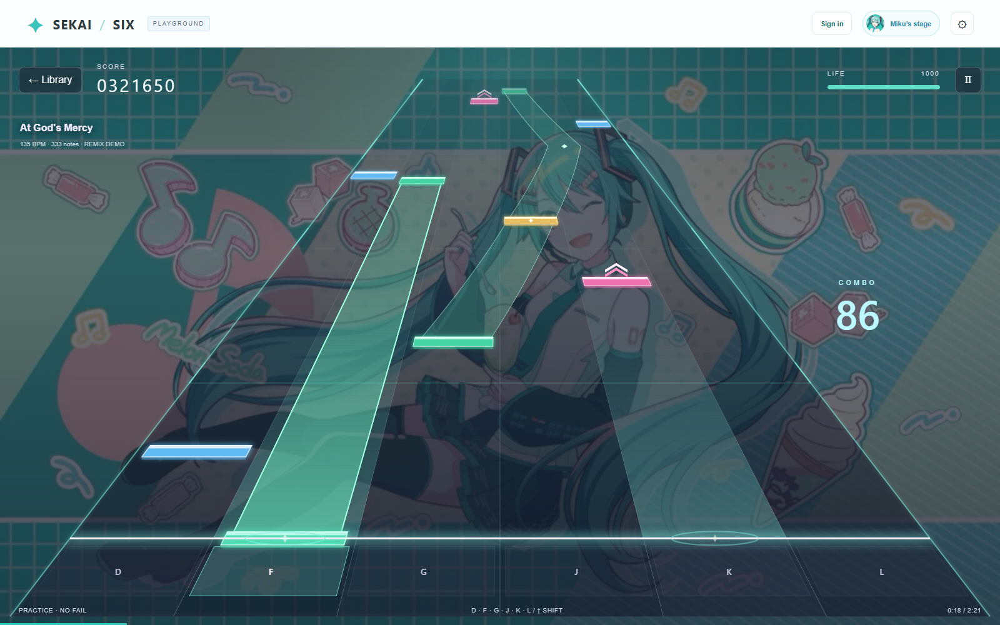
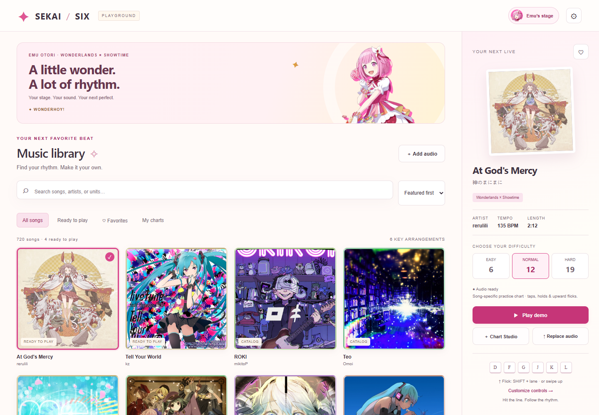
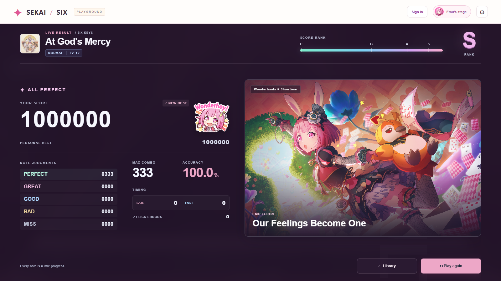
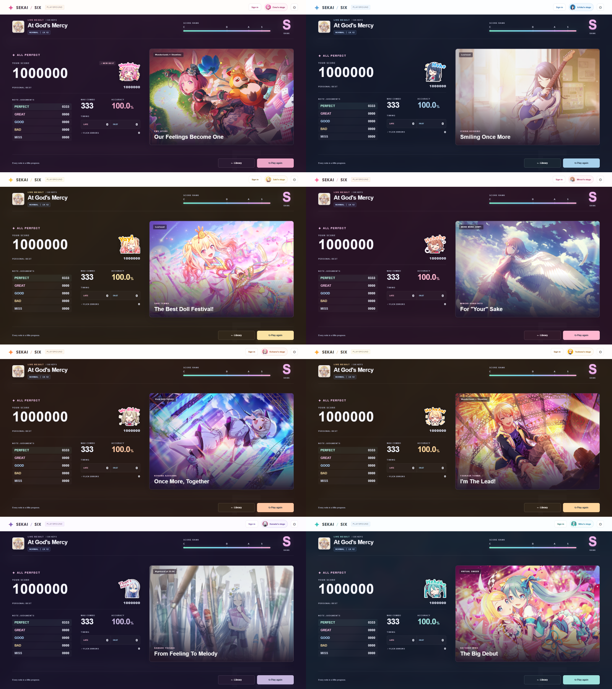
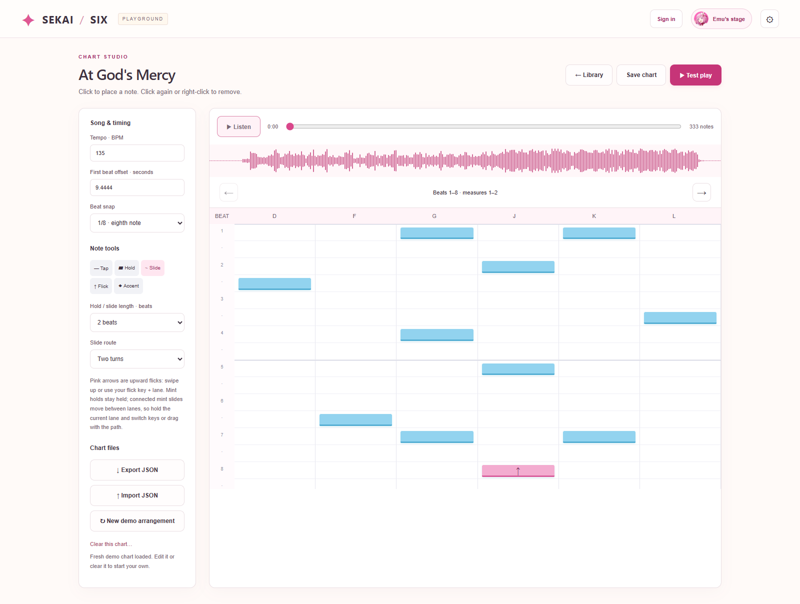

# SEKAI / SIX

**Six keys. Your music. Your stage.**

A personal, browser-based rhythm game inspired by Project SEKAI: a colorful song library, an approaching six-lane stage, character themes, and a chart editor for making your own arrangements.

[**Play the game →**](https://sekai-six-demo.vercel.app/) · [Get started](#run-locally) · [Create a chart](#chart-studio) · [Feature gallery](#feature-gallery)



## What's new

- **Character result cards:** all eight character themes show their own official trained card illustration, plus a matching reaction stamp for a New Best, Full Combo, or All Perfect. Phones use a compact illustrated banner. [Artwork sources](assets/results/SOURCES.md).
- **Miku's new stage:** a mint-and-teal illustrated background supplied by the project owner, with a portrait crop for smaller screens.
- **A deeper approaching lane:** a narrower horizon, wider judgment line, accelerating note movement, glowing hold and slide trails, beat lighting, and theme-colored hit effects.
- **A redesigned results screen:** clearer score/rank hierarchy, grouped judgments and timing stats, character artwork, and layouts for desktop, ultrawide, mobile, and short landscape screens.
- **Custom music videos:** choose video On/Off before a live, import an MP4/WebM, and save a per-song delay. The clip waits through the count-in and follows pause, resume, and restart.

## At a glance

| Feature | Included |
| --- | --- |
| Music library | **40 hosted audio tracks**, covers, search, favorites, and three practice difficulties. The full **721-song metadata catalog** remains in `catalog.json`; entries without hosted audio are hidden from the website library. |
| Six-key gameplay | Keyboard and touch input; taps, holds, lane-switching slides, upward flicks, and critical/accent notes. |
| Chart Studio | Waveform, beat grid, BPM/offset adjustment, beat snapping, five slide routes, test play, and JSON import/export. |
| Personal controls | Rebind every lane and the flick modifier, choose a keyboard preset, or enable tap-assist flicks. |
| Sound and timing | Original Project SEKAI hit samples plus Pop, Soft, and Arcade styles; separate music/hit volumes; note travel time; timing offset; no-fail practice. |
| Character themes | Emu, Ichika, Saki, Minori, Kohane, Tsukasa, Kanade, Hatsune Miku, and a quiet Classic theme. |
| Stage appearance | Perspective or straight lanes, note size, artwork dimming, and optional glow/particles. Decorative motion respects reduced-motion preferences. |
| Post-live results | C/B/A/S rank, five judgment counts, max combo, accuracy, FAST/LATE and flick errors, personal bests, Full Combo and All Perfect badges. |
| Music videos | Local MP4/WebM import, On/Off selection, and a saved timing adjustment for each song. |
| Accounts | Optional Google/Discord sign-in through Supabase; sync settings, favorites, charts, and personal-best records. |

The charts are original, audio-informed practice arrangements—not the official Project SEKAI charts. They are deterministic for each song/difficulty and can be edited when their timing needs adjustment. Scores use this demo's one-million-point scale, without card-power bonuses.

## Feature gallery

The Emu gameplay screenshot was captured during a live song, and Chart Studio was captured from the running app. Results show example score data. Local video controls are demonstrated with an imported preview clip.

### Pick your next live

Browse the hosted songs, pick a difficulty, favorite a track, or open Chart Studio.



### See your results



Each character has a matching illustration and celebration stamp:



### Build a chart

Place notes against the waveform and beat grid, shape a slide route, and test the arrangement without leaving the app.



## Run locally

Requires Node.js 18 or newer. The basic game has no install-time dependencies.

```bash
npm start
```

Open [http://127.0.0.1:5173](http://127.0.0.1:5173). Keep the server running. Use the server URL rather than opening `index.html` directly.

`npm start` runs the static gameplay preview. It does not run the Vercel `/api/auth-config` function, so Google/Discord login and cloud saves are available on a configured deployment, not this basic local server.

## Play

- Default lane keys are **D F G / J K L**. Change them in **Settings → Controls**; duplicate and reserved bindings are rejected.
- Tap at the judgment line. Keep a hold pressed through its tail. For slides, switch to the lane underneath the path, or follow it with a finger.
- Pink flick notes use **Shift + lane** on keyboard or an upward swipe on touch. Tap assist is available in Controls.
- **Escape** pauses. Resume includes a count-in; re-hold any active long notes during it. Practice mode keeps the song going at zero life.
- Adjust note travel time, music/hit volumes, and timing in **Settings → Play & sound**. Positive timing offsets move notes later and apply on the next play.
- Try **Perspective · approaching stage** for the deeper lane, or **Straight · vertical lanes** for a linear view. Change note size and background dimming in Appearance.

### Music video timing

1. Select a song and use **Add MMD** to import its MP4 or WebM (under 200 MB).
2. Turn **Music video** on before playing. The video stays muted; the selected song supplies the audio.
3. If the clip is ahead of the music, increase **Video delay**. A negative value skips the clip's intro. For example, `+1.00` starts the video one second later, while `-1.00` starts one second into it.

Video files, On/Off choices, and delay values are saved in that browser. They are not uploaded to the website or synced to other devices. No MVs are bundled with the deployment. **Replace audio** can similarly attach a local recording to an existing track; the shared catalog remains unchanged.

### Results and grades

| Rank | Score on the demo's 1,000,000-point scale |
| --- | --- |
| C | Below 500,000 |
| B | 500,000–749,999 |
| A | 750,000–899,999 |
| S | 900,000–1,000,000 |

GOOD, BAD, and MISS break combo. Full Combo requires every note to be PERFECT or GREAT; All Perfect requires every note to be PERFECT. FAST/LATE describe non-perfect timing judgments, and FLICK ERRORS count flicks judged in the wrong direction. Personal bests are kept per exact chart and difficulty.

## Chart Studio

Open a song and choose **Chart Studio**. Set BPM and first-beat offset, pick quarter/eighth/sixteenth-note snapping, and place taps, holds, slides, flicks, or accents on the eight-beat pages.

Slides offer five route presets: toward center or edge, with or without returning, plus a two-turn route. Set the hold/slide length, choose a route, and place its head. JSON charts can also define slide control points.

Use **Listen** to inspect the audio, **Test play** to try the working chart, and **Save chart** to keep it. Export JSON for backups or transfer between browsers; chart exports do not contain audio or video.

## Accounts and deployment

The live site is hosted on Vercel. Google/Discord authentication and cloud saves use Supabase. For your own deployment:

1. Configure the database using [`supabase/schema.sql`](supabase/schema.sql).
2. Set `SUPABASE_URL` and `SUPABASE_ANON_KEY` in the Vercel project's environment settings. The latter is the public anon/publishable key, not a service-role key.
3. Configure the Google/Discord providers in Supabase and add the deployed site's URL to the authentication redirect allow-list.
4. Redeploy so [`api/auth-config.js`](api/auth-config.js) can expose the public browser configuration.

Provider client secrets stay in Supabase. Cloud sync covers settings, favorites, charts, and personal-best records; imported media and video timing preferences stay local. The game remains playable without signing in.

Vercel serves the static app from the project root plus the auth configuration function. [`.vercelignore`](.vercelignore) keeps development files and documentation screenshots out of the deployed site.

## Checks and catalog

```bash
npm test
npm run build
```

Tests cover chart variety and validity, timing windows, slide handovers, sound behavior, control preferences, hosted-song filtering, perspective/pointer alignment, result grading, chart-specific records, and video timing. The build regenerates `catalog.json` from the checked-in metadata snapshots; it does not download new songs.

The latest layout was checked at desktop, laptop, ultrawide, portrait mobile, and short landscape sizes. Screenshot assets for this page are in [`docs/screenshots/`](docs/screenshots/).

## Credits and scope

- Song metadata uses the public [Sekai-World master database](https://github.com/Sekai-World/sekai-master-db-diff) and its [English localization data](https://github.com/Sekai-World/sekai-master-db-en-diff).
- Profile artwork, song jackets, music, and game sound effects belong to their respective rights holders. Asset sources are documented in [`assets/`](assets/), including [character artwork](assets/characters/SOURCES.md), [Emu artwork](assets/emu/SOURCES.md), [music](assets/AUDIO-SOURCES.md), and [hit sounds](assets/sfx/SOURCES.md).
- Miku's new gameplay background was supplied by the project owner. Its original artist/source URL was not provided; see the [background source note](assets/characters/SOURCES.md#user-supplied-miku-background).
- Project SEKAI is © SEGA / Colorful Palette Inc. / Crypton Future Media, INC. This is an unofficial personal project, not affiliated with or endorsed by them.
- Official Project SEKAI charts and character voice-line recordings are not included. Playable charts are original practice arrangements.
