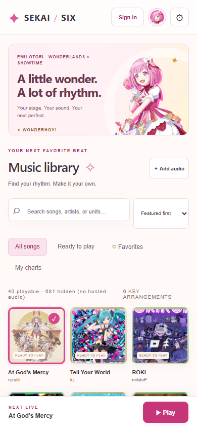
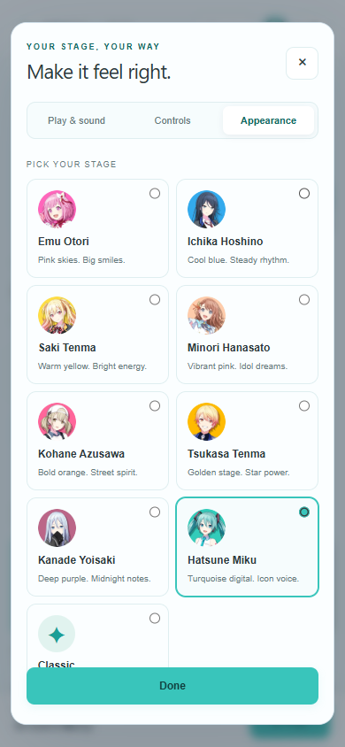

# SEKAI / SIX

**A tiny six-lane rhythm-game playground.** Pick a song, shape a chart, tune your controls, and take the stage.

SEKAI / SIX is an unofficial, browser-based personal project inspired by the feel of Project SEKAI. It focuses on a clean song-library layout, readable six-key gameplay, and a built-in chart editor. Charts in this project are original practice arrangements—not official Project SEKAI charts—and official character voice recordings are not included.


## At a glance

- Six lanes with keyboard or touch input, configurable bindings, and upward flicks.
- Audio-informed, deterministic practice-chart generation at Easy, Normal, and Hard, plus a playable demo chart.
- Chart Studio with a waveform, beat grid, BPM and offset controls, taps, holds, flicks, accents, test play, and JSON import/export.
- A 721-entry metadata catalog retained in `catalog.json`; the live library only shows tracks with audio hosted in the deployment.
- Search, favorites, custom audio, and a bundled starter selection. At present, four songs have audio files on-site.
- Character themes for Emu Otori, Ichika Hoshino, Saki Tenma, Minori Hanasato, Kohane Azusawa, Tsukasa Tenma, Kanade Yoisaki, and Hatsune Miku, plus a Classic theme.
- Hit-sound styles, volume and timing settings, lane perspective options, effects, and no-fail practice.
- Optional Google and Discord sign-in with Supabase-backed settings, favorites, charts, and scores.

> **Demo note:** only songs with audio bundled in the deployment appear in the website library. The full catalog remains in `catalog.json`; entries without a hosted audio file are hidden from the UI. Generated charts are for practice and may need timing adjustment or editing.

## Screenshots

| Six-lane live play | Chart Studio |
| --- | --- |
|  |  |

| Mobile library | Mobile settings |
| --- | --- |
|  |  |

## Run locally

Requires Node.js 18 or newer. Dependencies are not needed for the basic app.

```bash
npm start
```

Open [http://127.0.0.1:5173](http://127.0.0.1:5173). Keep the server running and use a browser; opening `index.html` directly as a file will not work correctly.

## Play

- Default lanes: **D F G J K L**. Change them in **Settings → Controls**. Reserved and duplicate bindings are rejected.
- Tap a lane at the judgment line. Hold notes stay pressed through the tail. Swipe upward on touch for a flick; on keyboard, use **Shift + lane** (or the optional tap assist).
- **Escape** pauses. The game pauses when the browser loses focus and resumes with a count-in.
- Pick a song and difficulty, or try the featured demo. No-fail practice is enabled by default.
- A positive timing offset moves the notes later relative to the music. Change the offset in Settings; it applies on the next play.

## Make a chart

Open a song and choose **Chart Studio**. Set BPM and the first-beat offset, place notes on the eight-beat pages, then test the working chart before saving. The editor supports quarter-, eighth-, and sixteenth-note snapping, taps, holds, flicks, and accents. Export charts as JSON to back them up or move them between browsers. Audio is not included in chart exports.

## Accounts and cloud saves

Google and Discord sign-in use Supabase Auth. Cloud saves require the Supabase schema and environment variables described in [`supabase/schema.sql`](supabase/schema.sql) and the setup notes below. The browser should only receive the public anon/publishable key—never a service-role key.

For a local setup, configure `SUPABASE_URL` and `SUPABASE_ANON_KEY` in the environment used by the server. For Vercel, configure those values in the project's environment settings and redeploy. Add your own app's URLs to the Supabase auth redirect allow-list and configure Google/Discord provider credentials in the Supabase dashboard. Provider secrets belong in Supabase, not in this repository.

## Tests and catalog

```bash
npm test
npm run build
```

The tests cover chart generation and variety, difficulty density, lane use, timing windows, note overlaps, flicks, legacy chart import, and preference migration. `npm run build` regenerates the catalog from the checked-in source snapshots.

## Credits and scope

- Song metadata is based on the public [Sekai-World master database](https://github.com/Sekai-World/sekai-master-db-diff) and its [English localization data](https://github.com/Sekai-World/sekai-master-db-en-diff).
- Character artwork, song jacket art, and any bundled game audio remain the property of their respective rights holders. Source notes and asset manifests are in the `assets/` directory.
- Project SEKAI is © SEGA / Colorful Palette Inc. / Crypton Future Media, INC. This is an unofficial personal project and is not affiliated with or endorsed by them.
- **No official charts or character voice lines are included.** The playable charts are original practice charts; this repository does not include voice-line recordings.

If you publish a fork or deployment, check the rights and terms for every media asset and audio source you include.
